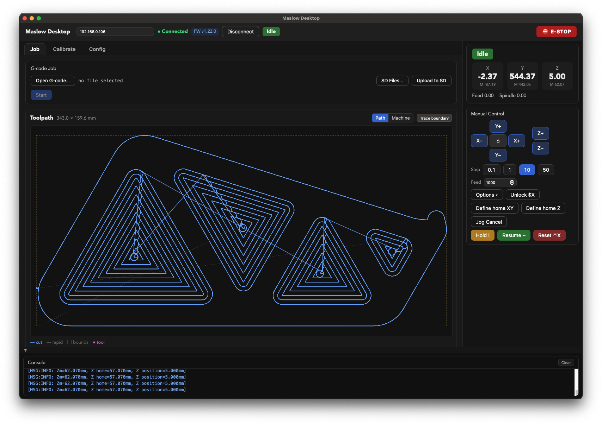
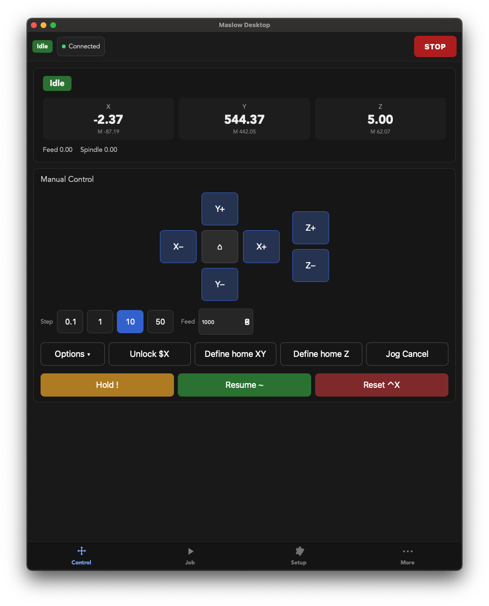
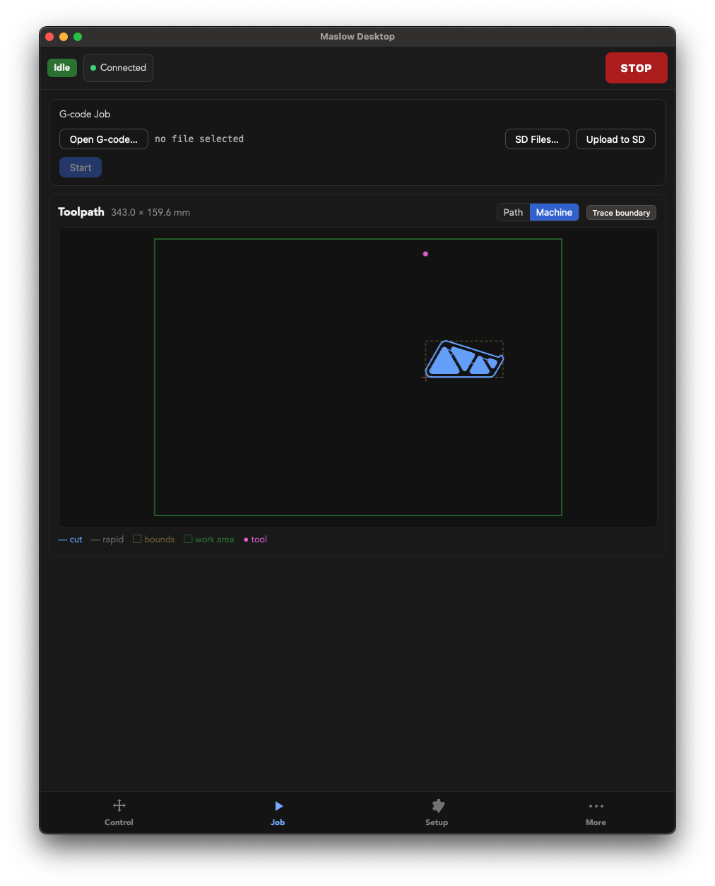
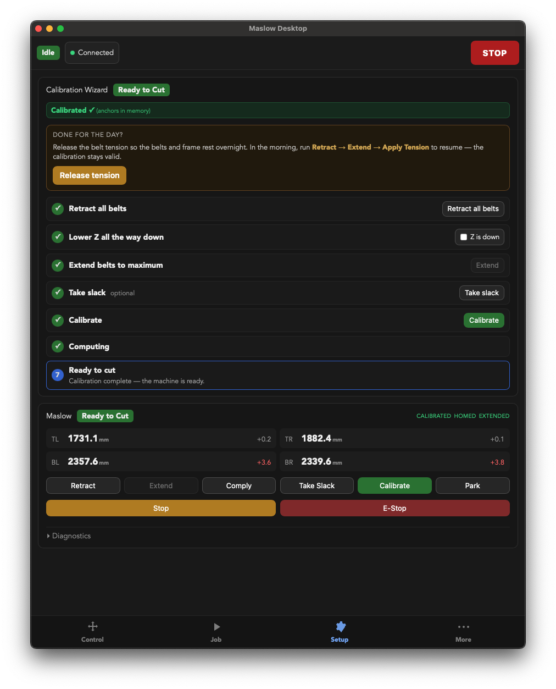
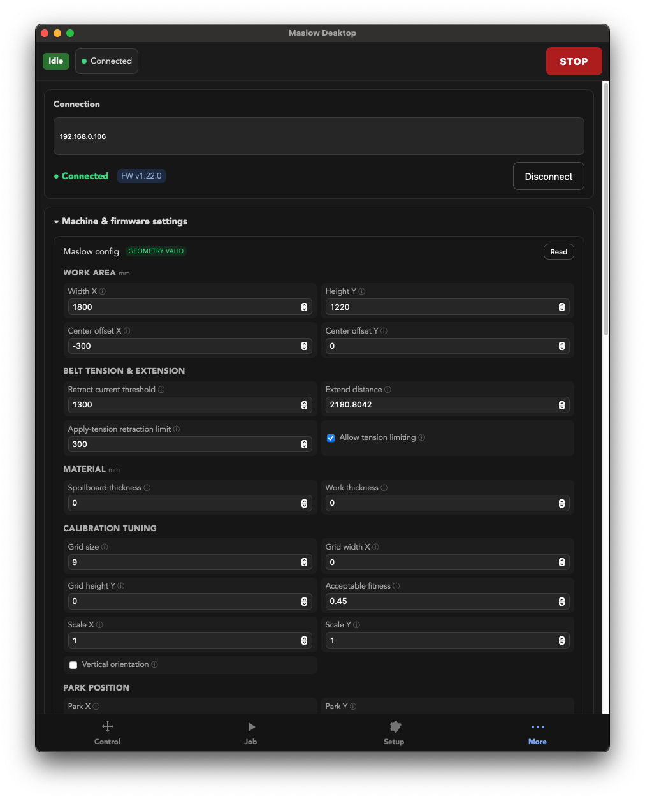
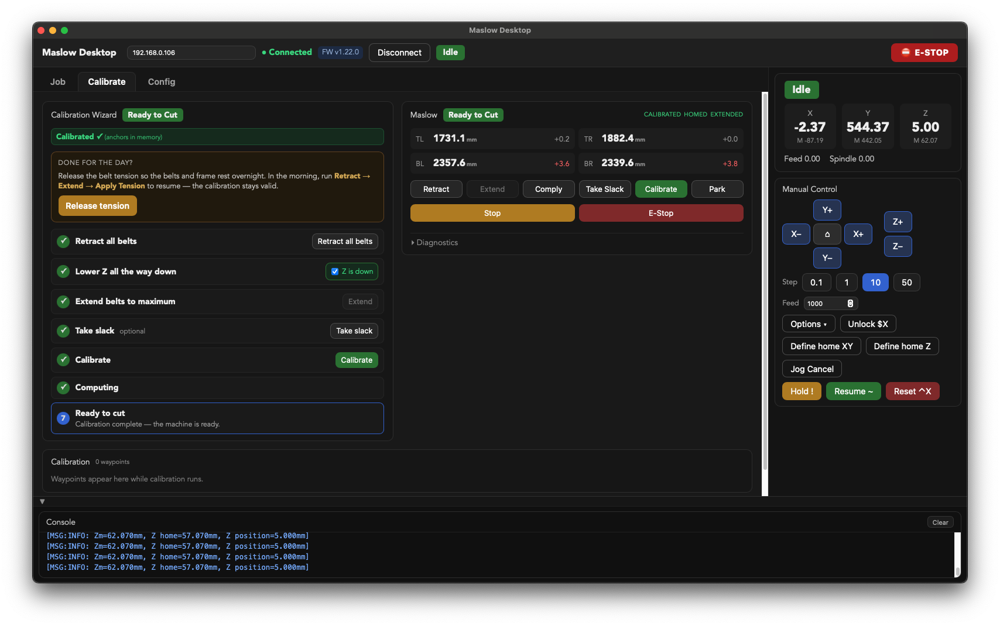

# Maslow Desktop

A friendly control panel for the [Maslow CNC](https://www.maslowcnc.com/) running FluidNC — on **desktop, tablet and phone**.

It connects to your machine over the network and covers almost everything the built-in FluidNC web UI does, with two things it does better: it **respects the Maslow calibration state machine** so you can't push the machine into an invalid or stuck state, and it wraps calibration in a **plain-language guided wizard**.



## Why another control panel?

- **State-machine aware** — every action is gated against the firmware's allowed transitions (retract → extend → take slack → calibrate → ready to cut). No more "why is my machine stuck in an unknown state?" after a mis-step.
- **Guided calibration wizard** — each step is explained in everyday language, advances automatically as the firmware reports progress, and offers a one-tap **daily resume** (just re-apply tension) plus **release tension** so the belts and frame can rest overnight.
- **One responsive app** — a real desktop app (macOS / Windows / Linux) and a touch-first layout for a tablet or phone mounted next to the machine, with **manual control as the landing screen**.
- **Almost full feature parity** with the FluidNC web UI — jogging, jobs, SD card, settings and a raw console are all here.

## Features

- **Manual control** — XY/Z jog pad, selectable step sizes & feed, Home, Unlock, Hold / Resume / Reset, jog cancel
- **Work zero** — define and go-to home for XY and Z separately
- **Calibration wizard** — live state, automatic step tracking, daily resume, overnight tension release
- **Maslow panel** — belt telemetry, retract / extend / comply / take slack / calibrate / park, Stop / E-Stop, diagnostics
- **G-code jobs** — open a local file or run from the SD card, 2D toolpath preview (path / machine / trace boundary), streaming with progress and **resume of interrupted jobs**
- **SD card browser** — preview, run, upload and delete files
- **Machine & firmware settings** — work area, belt tension, material, calibration tuning and park position, edited and saved straight to the firmware
- **Console** — send raw GRBL/FluidNC commands
- Always-visible **machine state** and **STOP**

## Screenshots

| Manual control | Job & toolpath | Calibration | Settings |
| --- | --- | --- | --- |
|  |  |  |  |



## Getting started

You'll need a Maslow running **FluidNC** reachable on your network (by `maslow.local` or its IP).

### Prerequisites

- [Node.js](https://nodejs.org/) 18+
- [Rust](https://www.rust-lang.org/tools/install) and the [Tauri prerequisites](https://tauri.app/start/prerequisites/) for your OS

### Develop

```bash
npm install
npm run tauri dev
```

### Build

```bash
npm run tauri build
```

The packaged app lands in `src-tauri/target/release/`.

## Tech stack

[Tauri 2](https://tauri.app/) (Rust core) · [SvelteKit](https://kit.svelte.dev/) + [Svelte 5](https://svelte.dev/) · TypeScript. The frontend talks to FluidNC over WebSocket and HTTP; the Rust side owns the connection, job streaming and the calibration state model.

## Disclaimer

This is a community project and is **not affiliated with Maslow CNC or FluidNC**. CNC machines can cause injury and damage — use at your own risk and keep the physical emergency stop within reach.

## License

Released under the MIT License.
